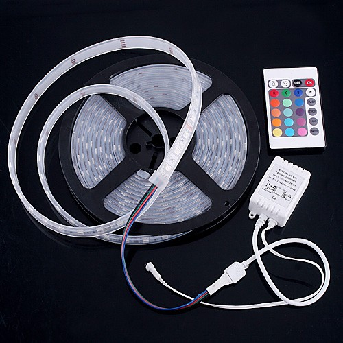
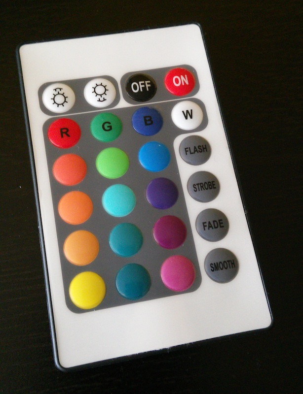
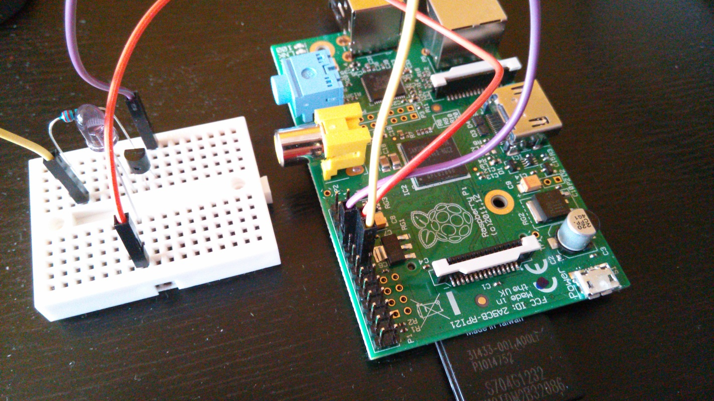
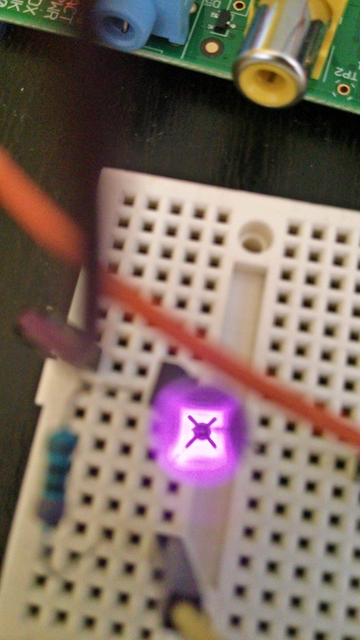

# Raspberry Pi RGB Led Strip Remote Emulator #

This project aims to emulate unbranded Chinese RGB LED strip remote using Raspberry Pi, Arch Linux, IR LED, and LIRC.

This is the remote control we are trying to emulate. It has 24 buttons.

## Hardware ##

### Raspberry Pi ###
Any version of Raspberry Pi will do.

### Schematics ###

 - Q1 - NPN Bipolar Transistor. S9014 or similar.
 - L1 - IR LED
 - R1 - 220 Ohm resistor

Most of the Pi's GPIO port can be used. This project assumes that GPIO port 22 is used.

## Software Installation & Configuration ##
Steps need to be done:
 - Install LIRC
 - Enable the lirc-rpi module
 - Add the remote configuration file

### LIRC ###
Install LIRC. On Arch Linux, use this command:

    pacman -S lirc

After installation, LIRC can be configured

#### Configuration ####
Open the `/etc/lirc_options.conf` file and add `lirc_rpi` in the modules field. So the line should be:

    modules = [lirc_rpi]

Save the file.

Copy the remote file `etc/lirc/nec-rgb-led.conf` to the remote include directory. In Arch Linux, this directory is `/etc/lirc/lircd.conf.d`
 

### Device Tree overlay ###
Open `/boot/config.txt` file and add the following line:

    dtoverlay=lirc-rpi,gpio_out_pin=22,gpio_in_pin=13

If necessary, modify the `gpio_out_pin` value to match the GPIO being used.

Port 13 is the default GPIO IN setting. This project does not require it, so it can be left as is. 

After saving, reboot the Raspberry Pi. If everything is properly configured the `ls /etc/lirc0` will not return a file not found error.

Note: More information about Device Tree Overlay is available [here](https://www.raspberrypi.org/documentation/configuration/device-tree.md).

## Usage ##
First, make sure that LIRC daemon is started.

    systemctl start lircd

Note: Run `systemctl enable lircd` to start LIRC on boot.

After LIRC is started, send signals using the following command:

    irsend SEND_ONCE RGBLED <COMMAND NAME>

List of the commands can be found in the remote configuration file.

## Sources / More Information ##
This project made possible information provided by various sources:

 - Template and protocol configuration for the remote was found [on this forum thread](http://forum.osmc.tv/showthread.php?tid=7142). Note: the remote codes posted there are different from the this particular remote model
 - Remote codes were found [here](https://github.com/alistairallan/RgbIrLed/blob/master/RgbIrLed.cpp).
